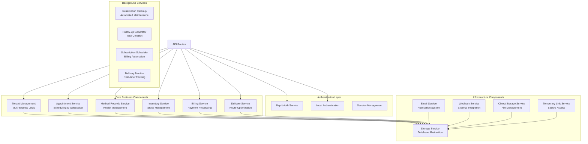
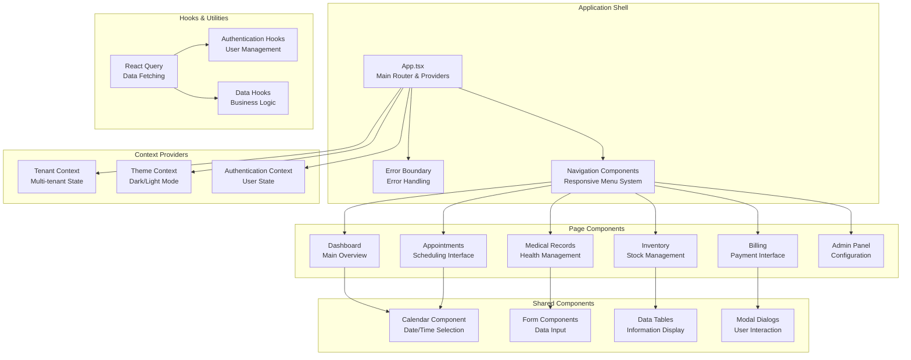
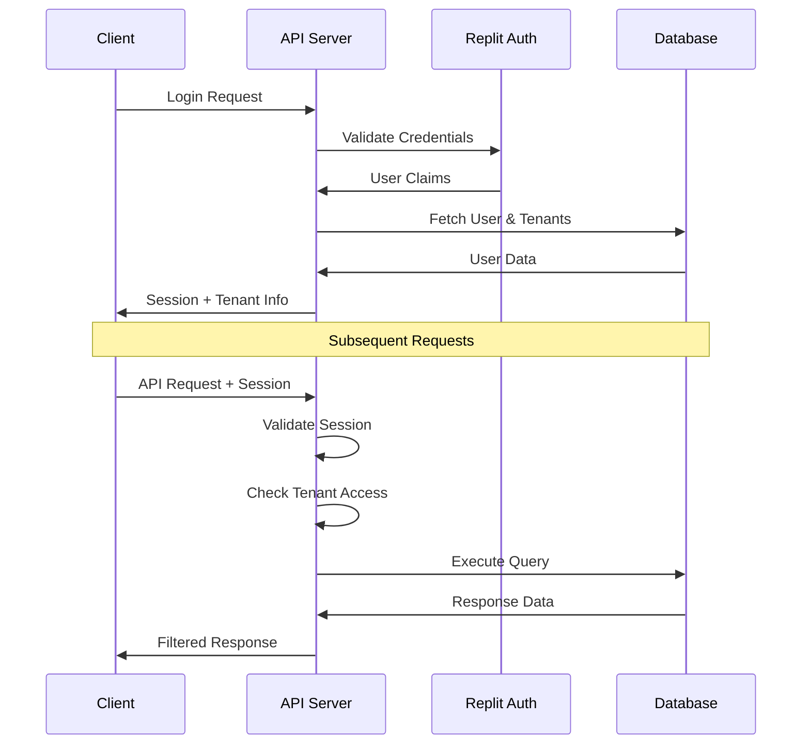

# VetGroom C4 Architecture Model

## System Overview
VetGroom is a comprehensive veterinary practice management system designed for multi-tenant operations. It provides appointment scheduling, medical record management, inventory tracking, billing, and delivery services for veterinary clinics.

---

## Level 1: System Context Diagram

```mermaid
graph TB
    User[Veterinary Staff<br/>Clients, Receptionists, Vets, Groomers]
    Admin[Super Admin<br/>System Administrators]
    Driver[Delivery Driver<br/>Mobile App Users]
    
    VetGroom[VetGroom Platform<br/>Multi-tenant Veterinary Management System]
    
    Email[Email Service<br/>SendGrid]
    Payment[Payment Gateway<br/>Stripe/PayPal]
    WhatsApp[WhatsApp API<br/>External Messaging]
    Storage[Object Storage<br/>Google Cloud Storage]
    Maps[Maps Service<br/>Route Optimization]
    
    User --> VetGroom : Uses web interface
    Admin --> VetGroom : System administration
    Driver --> VetGroom : Mobile delivery tracking
    
    VetGroom --> Email : Send notifications
    VetGroom --> Payment : Process payments
    VetGroom --> WhatsApp : Send messages
    VetGroom --> Storage : Store files/images
    VetGroom --> Maps : Optimize delivery routes
```

### External Dependencies
- **Email Service**: SendGrid for notifications and credentials
- **Payment Processing**: Stripe and PayPal for subscription billing
- **WhatsApp API**: External messaging service integration
- **Object Storage**: Google Cloud Storage for file management
- **Maps/Routing**: Geographic services for delivery optimization

---

## Level 2: Container Diagram

```mermaid
graph TB
    subgraph "VetGroom Platform"
        WebApp[Web Application<br/>React + TypeScript<br/>Port 5000]
        API[API Server<br/>Express.js + TypeScript<br/>REST & WebSocket]
        DB[(PostgreSQL Database<br/>Multi-tenant Schema)]
        
        subgraph "Background Services"
            WS[WebSocket Service<br/>Real-time Updates]
            Email[Email Scheduler<br/>Subscription Notifications]
            Webhook[Webhook Monitor<br/>External Service Integration]
            Delivery[Delivery Monitor<br/>Route Optimization]
            Cleanup[Reservation Cleanup<br/>Automated Maintenance]
            FollowUp[Follow-up Generator<br/>Task Automation]
        end
    end
    
    subgraph "External Services"
        SendGrid[SendGrid Email API]
        Stripe[Stripe Payment API]
        PayPal[PayPal Payment API]
        WhatsApp[WhatsApp Business API]
        GCS[Google Cloud Storage]
    end
    
    Users[Users] --> WebApp
    WebApp <--> API : HTTPS/WSS
    API <--> DB : Drizzle ORM
    
    API --> WS : Real-time events
    API --> Email : Schedule emails
    API --> Webhook : Process webhooks
    API --> Delivery : Track deliveries
    API --> Cleanup : Clean reservations
    API --> FollowUp : Generate tasks
    
    Email --> SendGrid
    API --> Stripe
    API --> PayPal
    API --> WhatsApp
    API --> GCS
```

### Container Responsibilities

#### Web Application (React Frontend)
- **Technology**: React 18, TypeScript, Vite, TailwindCSS
- **Responsibilities**: User interface, state management, responsive design
- **Key Features**: Multi-device support, real-time updates, form handling

#### API Server (Express Backend)
- **Technology**: Express.js, TypeScript, Node.js
- **Responsibilities**: Business logic, authentication, data access
- **Key Features**: RESTful APIs, WebSocket support, multi-tenant routing

#### PostgreSQL Database
- **Technology**: PostgreSQL with Drizzle ORM
- **Responsibilities**: Data persistence, multi-tenant isolation
- **Key Features**: ACID compliance, complex relationships, JSON support

---

## Level 3: Component Diagram - API Server



---

## Level 4: Code Structure - Frontend Components



---

## Data Flow Architecture

### Request Flow
1. **Client Request** → Web Application (React)
2. **API Call** → API Server (Express.js)
3. **Authentication** → Replit Auth / Local Auth
4. **Authorization** → Tenant & Role Validation
5. **Business Logic** → Service Layer
6. **Data Access** → Storage Layer (Drizzle ORM)
7. **Database** → PostgreSQL
8. **Response** → JSON Response
9. **State Update** → React Query Cache
10. **UI Update** → Component Re-render

### Real-time Updates
1. **Event Trigger** → Backend Service
2. **WebSocket Emit** → Scalable Appointment Service
3. **Client Reception** → WebSocket Handler
4. **State Invalidation** → React Query
5. **UI Refresh** → Automatic Re-render

---

## Security Architecture

### Authentication Flow


### Multi-tenant Isolation
- **Row-Level Security**: Every query filtered by tenant ID
- **Data Segregation**: Complete isolation between tenants
- **Role-Based Access**: Granular permissions within tenants
- **API Security**: JWT validation and tenant verification

---

## Performance Architecture

### Optimization Strategies
- **Connection Pooling**: PostgreSQL connection management
- **Query Optimization**: Indexed queries and efficient joins
- **Caching Strategy**: React Query for client-side caching
- **Real-time Updates**: WebSocket for live data sync
- **Code Splitting**: Lazy loading of React components
- **Asset Optimization**: Vite build optimization

### Scalability Considerations
- **Horizontal Scaling**: Stateless API servers
- **Database Scaling**: Read replicas and partitioning
- **CDN Integration**: Static asset distribution
- **Background Processing**: Asynchronous task handling
- **Monitoring**: Performance tracking and alerting

---

## Deployment Architecture

### Production Environment
- **Replit Deployment**: Automated CI/CD pipeline
- **Environment Configuration**: Production-ready settings
- **Database**: Managed PostgreSQL (Neon)
- **SSL/TLS**: Automatic HTTPS certificates
- **Monitoring**: Built-in logging and metrics

### Development Environment
- **Local Development**: Hot reload with Vite
- **Database**: Local PostgreSQL or development instance
- **Mock Services**: Development-friendly external service mocks
- **Debug Tools**: Comprehensive logging and error reporting

---

## Quality Attributes

### Reliability
- **Error Handling**: Comprehensive error boundaries
- **Data Validation**: Zod schema validation
- **Transaction Management**: ACID database operations
- **Graceful Degradation**: Fallback mechanisms

### Maintainability
- **Type Safety**: Full TypeScript implementation
- **Code Organization**: Modular component structure
- **Documentation**: Comprehensive inline documentation
- **Testing Strategy**: Unit and integration tests

### Usability
- **Responsive Design**: Multi-device compatibility
- **Accessibility**: WCAG compliance considerations
- **Internationalization**: Multi-language support ready
- **User Experience**: Intuitive navigation and feedback

### Performance
- **Loading Times**: Optimized bundle sizes
- **Real-time Updates**: WebSocket implementation
- **Database Performance**: Indexed queries and optimization
- **Memory Management**: Efficient state management

---

This C4 model provides a comprehensive view of the VetGroom architecture from system context down to code-level organization, enabling stakeholders to understand the system at different levels of detail.