# Database Schema & Relationships

## Schema Overview

The VetGroom database uses a multi-tenant architecture with hierarchical organization: **Companies** → **Tenants** → **Domain Data**

## Entity Relationship Diagram

```mermaid
erDiagram
    %% Core Multi-tenant Structure
    companies ||--o{ tenants : "owns"
    companies ||--o{ userCompanies : "employs"
    companies ||--o{ companySubscriptions : "subscribes"
    companies ||--o{ roles : "defines"
    
    tenants ||--o{ userTenants : "grants_access"
    tenants ||--o{ rooms : "contains"
    tenants ||--o{ staff : "employs"
    tenants ||--o{ clients : "serves"
    tenants ||--o{ appointments : "schedules"
    tenants ||--o{ services : "offers"
    tenants ||--o{ inventoryItems : "stocks"
    tenants ||--o{ vans : "operates"
    tenants ||--o{ medicalAppointments : "manages"
    tenants ||--o{ groomingRecords : "maintains"
    tenants ||--o{ followUpTasks : "tracks"
    
    %% User Management
    users ||--o{ userCompanies : "works_for"
    users ||--o{ userTenants : "accesses"
    users ||--o{ userSystemRoles : "has_system_role"
    
    roles ||--o{ userTenants : "assigned_to"
    systemRoles ||--o{ userSystemRoles : "grants"
    
    %% Client & Pet Management
    clients ||--o{ pets : "owns"
    clients ||--o{ appointments : "books"
    clients ||--o{ medicalAppointments : "schedules"
    clients ||--o{ groomingRecords : "requests"
    
    pets ||--o{ appointments : "attends"
    pets ||--o{ medicalRecords : "has_records"
    pets ||--o{ medicalAppointments : "visits"
    pets ||--o{ groomingRecords : "groomed"
    pets ||--o{ vaccinationRecords : "vaccinated"
    pets ||--o{ prescriptions : "prescribed"
    pets ||--o{ petHealthProfiles : "profiled"
    pets ||--o{ followUpTasks : "requires_followup"
    
    %% Appointment System
    appointments ||--o{ slotReservations : "reserves"
    appointments }o--|| rooms : "assigned_to"
    appointments }o--|| staff : "assigned_to"
    appointments }o--|| services : "uses"
    
    %% Medical System
    medicalAppointments ||--o{ medicalRecords : "generates"
    medicalAppointments ||--o{ prescriptions : "prescribes"
    medicalAppointments ||--o{ vaccinationRecords : "administers"
    medicalAppointments ||--o{ medicalDocuments : "documents"
    medicalAppointments ||--o{ followUpTasks : "requires_followup"
    
    staff ||--o{ medicalAppointments : "conducts"
    staff ||--o{ groomingRecords : "performs"
    staff ||--o{ prescriptions : "prescribes"
    staff ||--o{ followUpTasks : "assigned_to"
    
    %% Inventory & Sales
    inventoryItems ||--o{ inventoryTransactions : "tracked"
    inventoryItems ||--o{ saleItems : "sold"
    inventoryItems ||--o{ salesOrderItems : "ordered"
    
    sales ||--o{ saleItems : "contains"
    salesOrders ||--o{ salesOrderItems : "includes"
    
    %% Delivery System
    vans ||--o{ vanCages : "equipped_with"
    vans ||--o{ deliveryTracking : "tracks"
    vans ||--o{ savedRoutes : "follows"
    
    vanCages ||--o{ cageAssignments : "assigned"
    deliveryTracking ||--o{ deliveryAlerts : "generates"
    deliveryTracking ||--o{ driverCheckIns : "records"
    
    %% Billing System
    companySubscriptions }o--|| subscriptionPlans : "subscribes_to"
    billingInvoices ||--o{ invoiceLineItems : "itemizes"
    
    %% External Services
    companies ||--o{ externalServiceSubscriptions : "subscribes"
    companies ||--o{ paymentGatewayConfig : "configures"
    companies ||--o{ emailConfig : "configures"
```



## Core Tables

### 1. Multi-tenant Foundation

#### companies
```sql
CREATE TABLE companies (
  id VARCHAR PRIMARY KEY DEFAULT gen_random_uuid(),
  name VARCHAR NOT NULL,
  domain VARCHAR UNIQUE,
  settings JSONB,
  subscription_status VARCHAR DEFAULT 'active',
  subscription_end_date TIMESTAMP,
  subscription_plan VARCHAR DEFAULT 'basic',
  
  -- Feature Flags
  delivery_tracking_enabled BOOLEAN DEFAULT FALSE,
  follow_up_heart_beat_enabled BOOLEAN DEFAULT TRUE,
  whatsapp_enabled BOOLEAN DEFAULT FALSE,
  auto_status_update_enabled BOOLEAN DEFAULT FALSE,
  pet_age_update_enabled BOOLEAN DEFAULT TRUE,
  calendar_auto_return_enabled BOOLEAN DEFAULT TRUE,
  
  -- Configuration
  follow_up_normal_threshold INTEGER DEFAULT 10,
  follow_up_urgent_threshold INTEGER DEFAULT 20,
  whatsapp_message_credits INTEGER DEFAULT 0,
  whatsapp_price_per_block DECIMAL(10,2) DEFAULT 29.99,
  auto_status_update_interval INTEGER DEFAULT 5,
  pet_age_update_interval INTEGER DEFAULT 1440,
  calendar_auto_return_timeout INTEGER DEFAULT 60,
  
  created_at TIMESTAMP DEFAULT NOW(),
  updated_at TIMESTAMP DEFAULT NOW()
);
```

#### tenants
```sql
CREATE TABLE tenants (
  id VARCHAR PRIMARY KEY DEFAULT gen_random_uuid(),
  company_id VARCHAR NOT NULL REFERENCES companies(id),
  name VARCHAR NOT NULL,
  subdomain VARCHAR NOT NULL UNIQUE,
  address TEXT,
  phone VARCHAR,
  email VARCHAR,
  latitude VARCHAR,
  longitude VARCHAR,
  postal_code VARCHAR,
  
  -- Business Hours
  open_time TIME DEFAULT '08:00',
  close_time TIME DEFAULT '18:00',
  time_slot_duration INTEGER DEFAULT 30,
  reservation_timeout INTEGER DEFAULT 5,
  
  -- Feature Overrides
  delivery_tracking_enabled BOOLEAN DEFAULT FALSE,
  settings JSONB,
  
  created_at TIMESTAMP DEFAULT NOW(),
  updated_at TIMESTAMP DEFAULT NOW()
);
```

### 2. User Management

#### users
```sql
CREATE TABLE users (
  id VARCHAR PRIMARY KEY DEFAULT gen_random_uuid(),
  email VARCHAR UNIQUE,
  first_name VARCHAR,
  last_name VARCHAR,
  profile_image_url VARCHAR,
  password VARCHAR, -- For local authentication
  created_at TIMESTAMP DEFAULT NOW(),
  updated_at TIMESTAMP DEFAULT NOW()
);
```

#### user_tenants
```sql
CREATE TABLE user_tenants (
  id VARCHAR PRIMARY KEY DEFAULT gen_random_uuid(),
  user_id VARCHAR NOT NULL REFERENCES users(id),
  tenant_id VARCHAR NOT NULL REFERENCES tenants(id),
  role_id VARCHAR REFERENCES roles(id),
  is_active BOOLEAN DEFAULT TRUE,
  created_at TIMESTAMP DEFAULT NOW()
);
```

#### roles
```sql
CREATE TABLE roles (
  id VARCHAR PRIMARY KEY DEFAULT gen_random_uuid(),
  company_id VARCHAR REFERENCES companies(id),
  name VARCHAR NOT NULL,
  display_name VARCHAR NOT NULL,
  description TEXT,
  department VARCHAR,
  system_level BOOLEAN DEFAULT FALSE,
  permissions JSONB,
  created_at TIMESTAMP DEFAULT NOW()
);
```

### 3. Client & Pet Management

#### clients
```sql
CREATE TABLE clients (
  id VARCHAR PRIMARY KEY DEFAULT gen_random_uuid(),
  tenant_id VARCHAR NOT NULL REFERENCES tenants(id),
  name VARCHAR NOT NULL,
  email VARCHAR,
  phone VARCHAR,
  address TEXT,
  city VARCHAR,
  postal_code VARCHAR,
  notes TEXT,
  created_at TIMESTAMP DEFAULT NOW(),
  updated_at TIMESTAMP DEFAULT NOW()
);
```

#### pets
```sql
CREATE TABLE pets (
  id VARCHAR PRIMARY KEY DEFAULT gen_random_uuid(),
  tenant_id VARCHAR NOT NULL REFERENCES tenants(id),
  client_id VARCHAR NOT NULL REFERENCES clients(id),
  name VARCHAR NOT NULL,
  species VARCHAR NOT NULL,
  breed VARCHAR,
  age_years INTEGER,
  age_months INTEGER,
  weight DECIMAL(5,2),
  color VARCHAR,
  gender VARCHAR,
  medical_notes TEXT,
  behavioral_notes TEXT,
  emergency_contact VARCHAR,
  microchip_id VARCHAR,
  created_at TIMESTAMP DEFAULT NOW(),
  updated_at TIMESTAMP DEFAULT NOW()
);
```

### 4. Appointment System

#### appointments
```sql
CREATE TABLE appointments (
  id VARCHAR PRIMARY KEY DEFAULT gen_random_uuid(),
  tenant_id VARCHAR NOT NULL REFERENCES tenants(id),
  client_id VARCHAR NOT NULL REFERENCES clients(id),
  pet_id VARCHAR NOT NULL REFERENCES pets(id),
  room_id VARCHAR REFERENCES rooms(id),
  staff_id VARCHAR REFERENCES staff(id),
  service_id VARCHAR REFERENCES services(id),
  
  scheduled_date DATE NOT NULL,
  scheduled_time TIME NOT NULL,
  duration INTEGER DEFAULT 30,
  status VARCHAR DEFAULT 'scheduled',
  type VARCHAR NOT NULL, -- 'medical', 'grooming', 'vaccination'
  logistics VARCHAR, -- 'pickup', 'delivered', 'walk_in'
  
  notes TEXT,
  internal_notes TEXT,
  price DECIMAL(10,2),
  
  created_at TIMESTAMP DEFAULT NOW(),
  updated_at TIMESTAMP DEFAULT NOW()
);
```

#### services
```sql
CREATE TABLE services (
  id VARCHAR PRIMARY KEY DEFAULT gen_random_uuid(),
  tenant_id VARCHAR NOT NULL REFERENCES tenants(id),
  name VARCHAR NOT NULL,
  description TEXT,
  duration INTEGER DEFAULT 30,
  price DECIMAL(10,2),
  category VARCHAR,
  is_active BOOLEAN DEFAULT TRUE,
  created_at TIMESTAMP DEFAULT NOW()
);
```

### 5. Medical System

#### medical_appointments
```sql
CREATE TABLE medical_appointments (
  id VARCHAR PRIMARY KEY DEFAULT gen_random_uuid(),
  tenant_id VARCHAR NOT NULL REFERENCES tenants(id),
  client_id VARCHAR NOT NULL REFERENCES clients(id),
  pet_id VARCHAR NOT NULL REFERENCES pets(id),
  staff_id VARCHAR REFERENCES staff(id),
  
  visit_date DATE NOT NULL,
  visit_time TIME,
  reason_for_visit TEXT,
  symptoms TEXT,
  diagnosis TEXT,
  treatment TEXT,
  recommendations TEXT,
  follow_up_required BOOLEAN DEFAULT FALSE,
  follow_up_date DATE,
  
  weight DECIMAL(5,2),
  temperature DECIMAL(4,1),
  heart_rate INTEGER,
  status VARCHAR DEFAULT 'scheduled',
  
  total_cost DECIMAL(10,2),
  notes TEXT,
  
  created_at TIMESTAMP DEFAULT NOW(),
  updated_at TIMESTAMP DEFAULT NOW()
);
```

#### medical_records
```sql
CREATE TABLE medical_records (
  id VARCHAR PRIMARY KEY DEFAULT gen_random_uuid(),
  tenant_id VARCHAR NOT NULL REFERENCES tenants(id),
  pet_id VARCHAR NOT NULL REFERENCES pets(id),
  medical_appointment_id VARCHAR REFERENCES medical_appointments(id),
  
  record_type VARCHAR NOT NULL, -- 'exam', 'surgery', 'vaccination', 'treatment'
  title VARCHAR NOT NULL,
  description TEXT,
  findings TEXT,
  treatment_plan TEXT,
  medications TEXT,
  
  veterinarian_id VARCHAR REFERENCES staff(id),
  record_date DATE NOT NULL,
  follow_up_required BOOLEAN DEFAULT FALSE,
  
  created_at TIMESTAMP DEFAULT NOW(),
  updated_at TIMESTAMP DEFAULT NOW()
);
```

### 6. Inventory Management

#### inventory_items
```sql
CREATE TABLE inventory_items (
  id VARCHAR PRIMARY KEY DEFAULT gen_random_uuid(),
  tenant_id VARCHAR NOT NULL REFERENCES tenants(id),
  name VARCHAR NOT NULL,
  description TEXT,
  category VARCHAR,
  sku VARCHAR,
  barcode VARCHAR,
  
  current_stock INTEGER DEFAULT 0,
  minimum_stock INTEGER DEFAULT 0,
  maximum_stock INTEGER,
  unit_cost DECIMAL(10,2),
  selling_price DECIMAL(10,2),
  
  supplier VARCHAR,
  expiry_date DATE,
  location VARCHAR,
  
  is_active BOOLEAN DEFAULT TRUE,
  created_at TIMESTAMP DEFAULT NOW(),
  updated_at TIMESTAMP DEFAULT NOW()
);
```

#### inventory_transactions
```sql
CREATE TABLE inventory_transactions (
  id VARCHAR PRIMARY KEY DEFAULT gen_random_uuid(),
  tenant_id VARCHAR NOT NULL REFERENCES tenants(id),
  item_id VARCHAR NOT NULL REFERENCES inventory_items(id),
  
  transaction_type VARCHAR NOT NULL, -- 'purchase', 'sale', 'adjustment', 'transfer'
  quantity INTEGER NOT NULL,
  unit_cost DECIMAL(10,2),
  total_cost DECIMAL(10,2),
  
  reference_id VARCHAR, -- Reference to sale, purchase order, etc.
  notes TEXT,
  
  created_at TIMESTAMP DEFAULT NOW()
);
```

### 7. Delivery System

#### vans
```sql
CREATE TABLE vans (
  id VARCHAR PRIMARY KEY DEFAULT gen_random_uuid(),
  tenant_id VARCHAR NOT NULL REFERENCES tenants(id),
  license_plate VARCHAR NOT NULL,
  model VARCHAR,
  capacity INTEGER DEFAULT 4,
  is_active BOOLEAN DEFAULT TRUE,
  current_location_lat DECIMAL(10,8),
  current_location_lng DECIMAL(11,8),
  created_at TIMESTAMP DEFAULT NOW()
);
```

#### delivery_tracking
```sql
CREATE TABLE delivery_tracking (
  id VARCHAR PRIMARY KEY DEFAULT gen_random_uuid(),
  tenant_id VARCHAR NOT NULL REFERENCES tenants(id),
  van_id VARCHAR NOT NULL REFERENCES vans(id),
  appointment_id VARCHAR REFERENCES appointments(id),
  
  pickup_address TEXT,
  delivery_address TEXT,
  pickup_lat DECIMAL(10,8),
  pickup_lng DECIMAL(11,8),
  delivery_lat DECIMAL(10,8),
  delivery_lng DECIMAL(11,8),
  
  status VARCHAR DEFAULT 'pending', -- 'pending', 'en_route', 'picked_up', 'delivered', 'cancelled'
  estimated_pickup_time TIMESTAMP,
  actual_pickup_time TIMESTAMP,
  estimated_delivery_time TIMESTAMP,
  actual_delivery_time TIMESTAMP,
  
  driver_notes TEXT,
  customer_signature VARCHAR,
  
  created_at TIMESTAMP DEFAULT NOW(),
  updated_at TIMESTAMP DEFAULT NOW()
);
```

### 8. Follow-up Task System

#### follow_up_tasks
```sql
CREATE TABLE follow_up_tasks (
  id VARCHAR PRIMARY KEY DEFAULT gen_random_uuid(),
  tenant_id VARCHAR NOT NULL REFERENCES tenants(id),
  appointment_id VARCHAR REFERENCES appointments(id),
  medical_appointment_id VARCHAR REFERENCES medical_appointments(id),
  grooming_record_id VARCHAR REFERENCES grooming_records(id),
  client_id VARCHAR NOT NULL REFERENCES clients(id),
  pet_id VARCHAR NOT NULL REFERENCES pets(id),
  
  task_type VARCHAR NOT NULL, -- 'medical_follow_up', 'grooming_follow_up', 'missing_diagnosis'
  priority VARCHAR DEFAULT 'normal', -- 'low', 'normal', 'high', 'urgent'
  title VARCHAR NOT NULL,
  description TEXT,
  missing_fields TEXT[], -- Array of missing field names
  
  due_date DATE,
  assigned_to VARCHAR REFERENCES staff(id),
  status VARCHAR DEFAULT 'pending', -- 'pending', 'in_progress', 'completed', 'cancelled'
  completed_by VARCHAR REFERENCES staff(id),
  completed_at TIMESTAMP,
  notes TEXT,
  metadata JSONB, -- Additional context or custom data
  
  created_at TIMESTAMP DEFAULT NOW(),
  updated_at TIMESTAMP DEFAULT NOW()
);
```

### 9. Billing & Subscription System

#### subscription_plans
```sql
CREATE TABLE subscription_plans (
  id VARCHAR PRIMARY KEY DEFAULT gen_random_uuid(),
  name VARCHAR NOT NULL,
  display_name VARCHAR NOT NULL,
  description TEXT,
  price_monthly DECIMAL(10,2),
  price_yearly DECIMAL(10,2),
  max_tenants INTEGER,
  max_users INTEGER,
  features JSONB,
  is_active BOOLEAN DEFAULT TRUE,
  created_at TIMESTAMP DEFAULT NOW()
);
```

#### company_subscriptions
```sql
CREATE TABLE company_subscriptions (
  id VARCHAR PRIMARY KEY DEFAULT gen_random_uuid(),
  company_id VARCHAR NOT NULL REFERENCES companies(id),
  plan_id VARCHAR NOT NULL REFERENCES subscription_plans(id),
  status VARCHAR DEFAULT 'active', -- 'active', 'cancelled', 'past_due', 'trial'
  current_period_start DATE NOT NULL,
  current_period_end DATE NOT NULL,
  trial_ends_at TIMESTAMP,
  cancelled_at TIMESTAMP,
  created_at TIMESTAMP DEFAULT NOW(),
  updated_at TIMESTAMP DEFAULT NOW()
);
```

## Key Relationships & Constraints

### Multi-tenant Data Isolation
```sql
-- Every tenant-scoped table includes tenant_id with foreign key
ALTER TABLE appointments ADD CONSTRAINT fk_appointments_tenant 
  FOREIGN KEY (tenant_id) REFERENCES tenants(id);

-- Row-level security policies (example)
CREATE POLICY tenant_isolation ON appointments 
  FOR ALL TO authenticated_users 
  USING (tenant_id = current_setting('app.current_tenant_id'));
```

### Cascade Relationships
```sql
-- Client deletion cascades to pets and appointments
ALTER TABLE pets ADD CONSTRAINT fk_pets_client 
  FOREIGN KEY (client_id) REFERENCES clients(id) ON DELETE CASCADE;

-- Appointment deletion cleans up related reservations
ALTER TABLE slot_reservations ADD CONSTRAINT fk_reservations_appointment 
  FOREIGN KEY (appointment_id) REFERENCES appointments(id) ON DELETE CASCADE;
```

### Business Logic Constraints
```sql
-- Ensure appointment times are within business hours
ALTER TABLE appointments ADD CONSTRAINT check_business_hours 
  CHECK (scheduled_time >= '06:00' AND scheduled_time <= '22:00');

-- Prevent negative inventory
ALTER TABLE inventory_items ADD CONSTRAINT check_positive_stock 
  CHECK (current_stock >= 0);

-- Validate subscription dates
ALTER TABLE company_subscriptions ADD CONSTRAINT check_subscription_period 
  CHECK (current_period_end > current_period_start);
```

## Indexing Strategy

### Performance Indexes
```sql
-- Multi-tenant queries
CREATE INDEX idx_appointments_tenant_date ON appointments(tenant_id, scheduled_date);
CREATE INDEX idx_clients_tenant ON clients(tenant_id);
CREATE INDEX idx_pets_client ON pets(client_id);

-- Search and filtering
CREATE INDEX idx_clients_name ON clients USING gin(to_tsvector('english', name));
CREATE INDEX idx_pets_name ON pets USING gin(to_tsvector('english', name));
CREATE INDEX idx_appointments_status ON appointments(status);

-- Foreign key relationships
CREATE INDEX idx_user_tenants_user ON user_tenants(user_id);
CREATE INDEX idx_user_tenants_tenant ON user_tenants(tenant_id);
CREATE INDEX idx_follow_up_tenant_status ON follow_up_tasks(tenant_id, status);

-- Time-based queries
CREATE INDEX idx_appointments_scheduled ON appointments(scheduled_date, scheduled_time);
CREATE INDEX idx_medical_appointments_date ON medical_appointments(visit_date);
CREATE INDEX idx_delivery_tracking_times ON delivery_tracking(estimated_pickup_time, estimated_delivery_time);
```

### Composite Indexes for Complex Queries
```sql
-- Dashboard statistics
CREATE INDEX idx_appointments_tenant_date_status ON appointments(tenant_id, scheduled_date, status);

-- Follow-up task management
CREATE INDEX idx_follow_up_tenant_priority_due ON follow_up_tasks(tenant_id, priority, due_date);

-- Inventory management
CREATE INDEX idx_inventory_tenant_category_active ON inventory_items(tenant_id, category, is_active);

-- Delivery optimization
CREATE INDEX idx_delivery_tenant_status_time ON delivery_tracking(tenant_id, status, estimated_pickup_time);
```

This comprehensive schema supports the full VetGroom platform functionality while maintaining data integrity, performance, and scalability through proper indexing and constraint management.